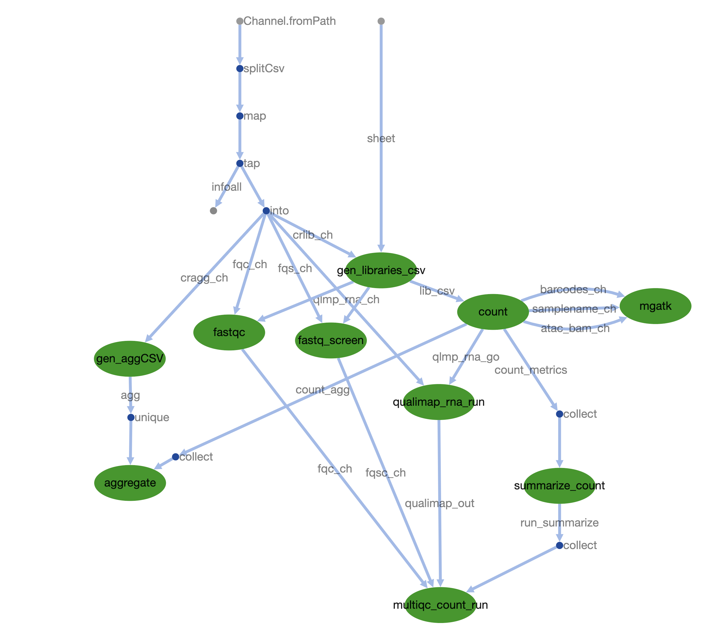

# Nextflow Pipeline for 10x MultiOme processing with measurement of heteroplasmy using mgatk

<br>
<br>


## Author: Malwina Prater   


--------------

## Description

Nextflow pipeline for processing 10x MultiOme datasets with CellRanger-arc and measuring mitochondrial heteroplasmy from ATAC-seq.

- Analyze 10x multiome (RNA + ATAC) in one pipeline.

- Starting point are fastq files


## Software requirements

| Software        | Version   |
|:-----           |:-----:    |
|  nextflow       | v.21.10.6 |  
|  multiqc        | v.1.14    |
|  mgatk          | v.0.6.6   |
|  qualimap       | v.2.2.1   |
|  fastqc         | v.0.11.8  |
|  fastq_screen   | v.0.14.1  |
|  cellranger-arc | v.2.0.1   |
|  bwa            | v.0.7.15  |
|  java           | min v.1.8 |


Cell Ranger arc was downloaded from 10x (https://support.10xgenomics.com/single-cell-multiome-atac-gex/software/downloads/latest).

You will need to change paths to the software and genomes in the nextflow config file.


---------------

## Processing

Set up a working directory, where you store fastq files, sample table and nextflow config:


### Input files

1. Sample table written in `.csv`

with formatting like:

````
Sample_ID,Sample_Project,Sample_Species,Sample_Lib,Sample_Pair
Sample2,ProjectID,mouse,rna,2
Sample2,ProjectID,mouse,atac,2
Sample1,ProjectID,mouse,rna,1
Sample1,ProjectID,mouse,atac,1
````

For NUMTs masked genome, it has to be specified in sample table as below:

````
Sample_ID,Sample_Project,Sample_Species,Sample_Lib,Sample_Pair
Sample2,ProjectID,mouse_NUMTs_masked,rna,2
Sample2,ProjectID,mouse_NUMTs_masked,atac,2
Sample1,ProjectID,mouse_NUMTs_masked,rna,1
Sample1,ProjectID,mouse_NUMTs_masked,atac,1
````


2. Organise directory with folder `fastq` and subfolders `atac` and `rna` (`fastq.gz` files can be soft linked):

````
fastq --|---rna ---|--Sample2_S1_L001_I1_001.fastq.gz
        |          |--Sample2_S1_L001_I2_001.fastq.gz
        |          |--Sample2_S1_L001_R1_001.fastq.gz
        |          |--Sample2_S1_L001_R2_001.fastq.gz
        |
        |---atac---|--Sample2_S1_L001_I1_001.fastq.gz
                   |--Sample2_S1_L001_R1_001.fastq.gz
                   |--Sample2_S1_L001_R2_001.fastq.gz
                   |--Sample2_S1_L001_R3_001.fastq.gz
````


3. Create nextflow config file using template [nextflow.config](nextflow.config), and modify directories and paths to genomes and software.


### Prepare genome.

This is already done for Mouse genome in directories (also unmasked genome for Human too):

````
/suffolk/WorkGenomicsE/mn367/Genomes/CellRanger_Genomes/refdata-cellranger-arc-mm10-2020-A-2.0.0
/suffolk/WorkGenomicsE/mn367/Genomes/CellRanger_Genomes/refdata-cellranger-arc-mm10-2020-A-2.0.0_MT_masked
/suffolk/WorkGenomicsE/mn367/Genomes/CellRanger_Genomes/refdata-cellranger-arc-GRCh38-2020-A-2.0.0
````

For NUMTs masking of the genome `mm10.full.backlist.bed` was downloaded from `https://github.com/caleblareau/mgatk/wiki/Increasing-coverage-from-10x-processing`.

Mask genome using script: [mask_NUMTs_genome.sh](Scripts/mask_NUMTs_genome.sh).

Once the masked fasta is ready, use script [CR_mkref.sh](Scripts/CR_mkref.sh) to make new CellRanger-arc genome. The config file was required to proceed with making new genome.


### How to run the multiome nextflow pipeline


Run nextflow on MBU cluster:

change directory to project dir, where fastq files are stored (or linked).

Before running the pipeline, change software paths, e.g. MultiQC, FastQ-screen, qualimap, CellRanger-arc, mgatk etc.

````

#module load nextflow/22

module load anaconda
module load qualimap

screen -S <session_name>

NXF_VER=21.10.6 nextflow run nf_pipeline_multiome.nf -config nextflow.config -resume

````


## Pipeline structure:


<br>
